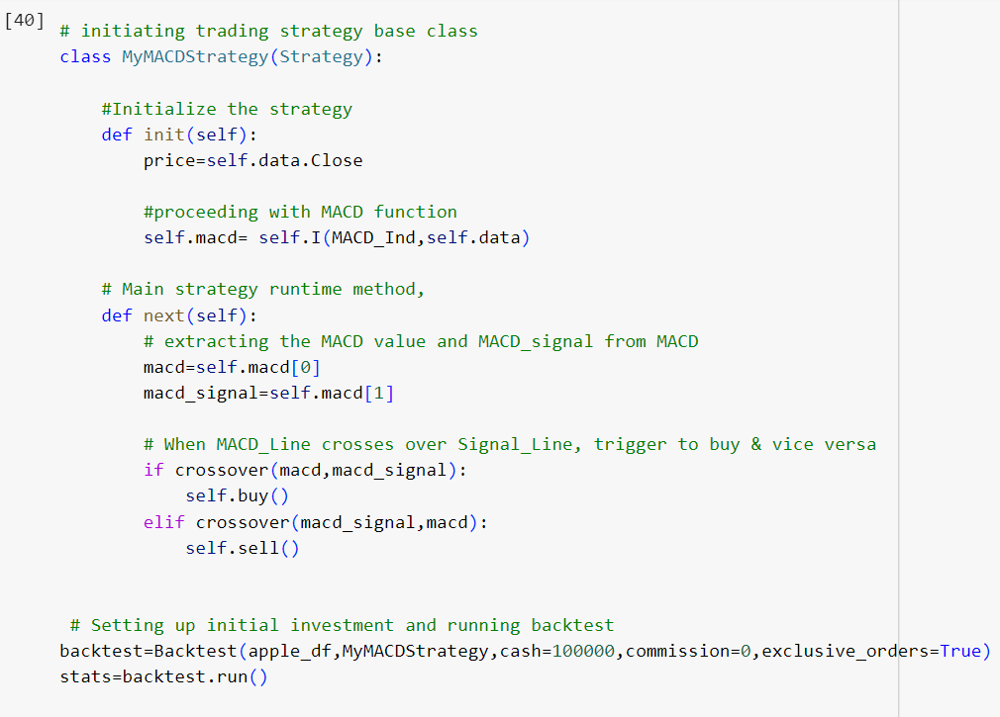
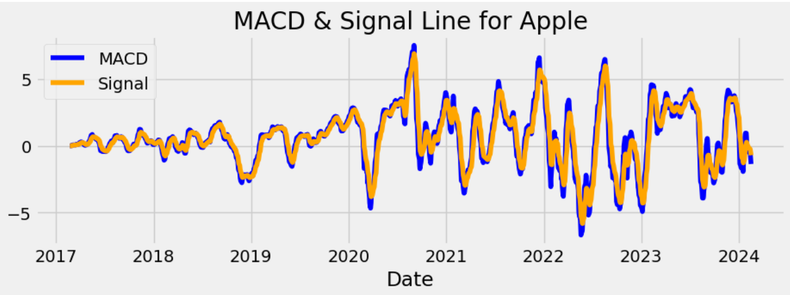
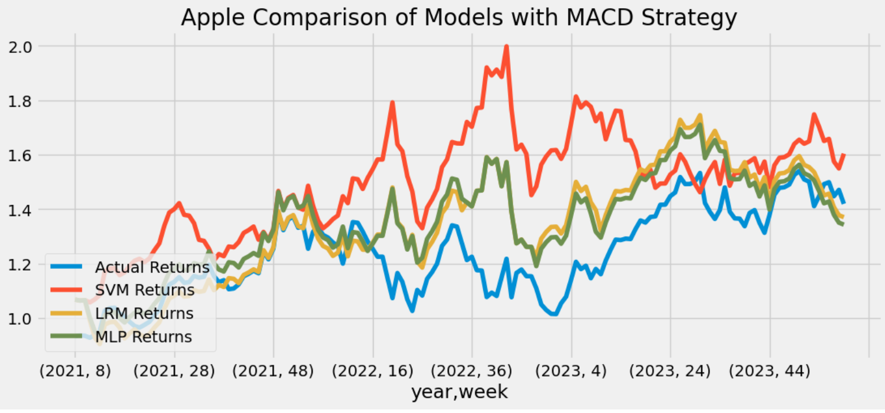
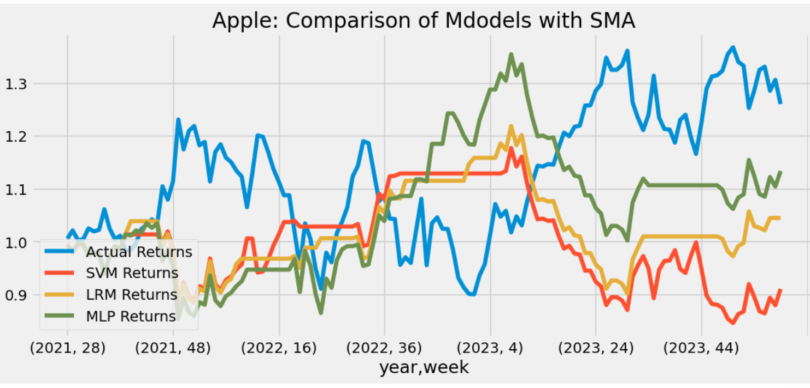
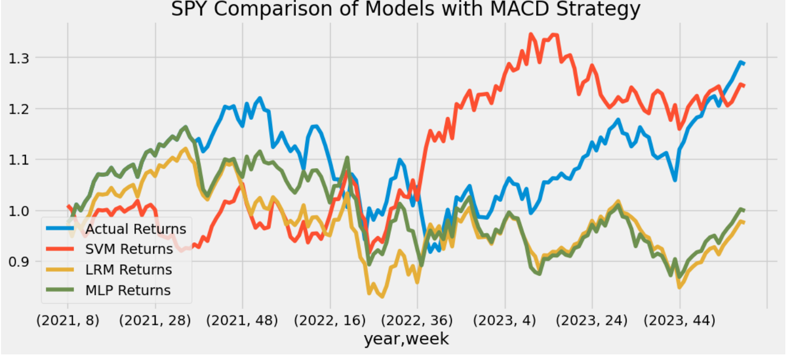
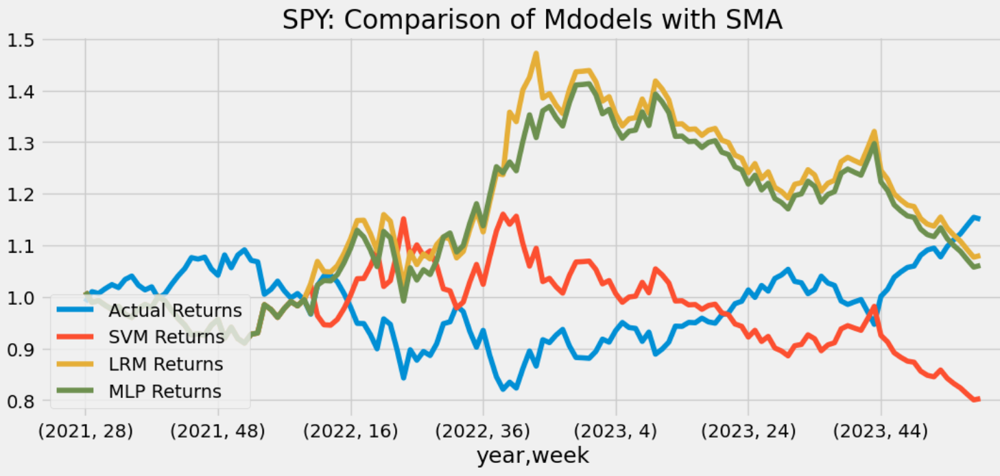

# Backtesting Trading Strategies with Python

Advancement of Artificial intelligence has made Machine Learning a popular tools for traders, as they can automate the trading by teaching their computers the trading process.Machine Learning models test the working of trading startegies on the pre determined data and updates on what has and has not been working. This jupyter notebook, has implemented algorithmic trading modeles using two indicators, Moving Average Convergence / Divergence (MACD) and Simple Moving Average (SMA) to analyze past price trends and generate buy & sell signals for trading. These strategies were tested with machine learning classifiers; Support Vector Model, Logistic Regression Model and Neural_Network MLP Classifier. In the second part of analysis, to test how good are our strategies, we implemented python framework 'backtesting.py'. Backtesting is analysis of strategies based upon the historical prices of given stocks. 

OHLCV data for for [“AAPL”] and ["SPY"] was collected through yahoo Finance with the help of Python’s datetime.timedelta function for past 7 years. Technical Indicators MACD and SMA were generated with help of 'finta'. 

Before, we deep dive into technical analysis, a brief understanding of chosen indicators is described below.

## Moving Average Convergence / Divergence (MACD)

MACD is a trend following momentum indicator that explains the reltionship between two exponential moving averages(EMA) of stock's price.  Generally, the longer EMA is calcualted for 26 days and shorter EMA is calculated for 13 days. MACD Line is calculated by subtracting the longer EMA from Sshorter EMA. MACD signal is generated by 9 days EMA. When the MACD line crosses above Signal line, it generates a buy signal and vice versa. 

MACD is best used with daily periods. It  alerts investors to bullish/bearish divergences (e.g., when a new high in price is not confirmed by a new high in MACD, and vice versa), suggesting a potential failure and reversal(1).

 
## Simple Moving Average (SMA)
Simple Moving Average is average of series of numerical values rolled over a period of time.In technical analysis of financial data moving averages are among most widely used trend following indicators that demonstrate the direction of the market’s trend. Because the SMA is a lagging indicator, the crossover technique may not capture exact tops and bottoms. But it can help traders identify the bulk of a trend(2). With crossover SMA, when shorter average crosses above the longer average, that generates a potential signal to buy. On the other hand, when the shorter SMA crosses below its longer counterpart, that may signal that an uptrend and a potential to sell.

## Backtesting.py
Backtesting invloves predictive modeling to determine if a model or strategy has perfomed well in the past. If so, then assuming other factors same, model or startegy is expected to perform well in the future data. Backtesting.py is a framework to backtest, optimize and improve trading strategies. Backtesting.py's fast, convenient approach and interactive ouput charts makes the development of successful trading system possible. Strategy syntax of backtesting.py extend Strategy class and override its two abstract methods: init() and next().

Method init() is invoked before the strategy is run. Within it, one ideally precomputes in efficient, vectorized manner whatever indicators and signals the strategy depends on.

Method next() is then iteratively called by the Backtest instance, once for each data point (data frame row), simulating the incremental availability of each new full candlestick bar.

In init() as well as in next(), the data the strategy is simulated on is available as an instance variable self.data.(3)

  

## Analysis

In our project we have used a crossover MACD startegy and SMA crossover Startegy to let the models drill a trade when the startegies calculates for a short period and crosses above the more extended period.

IF strategy(SHORT PERIOD) > Strategy(LONG PERIOD) => BUY

IF strategy(LONG PERIOD) > Strategy(SHORT PERIOD) => SELL

### AAPL
In the first part of programing, a baseline performance for trading algorithm was established by applying MACD startegy which generated the signals the signals to buy and sell. Trading algorithm were automated using machine learning techniques i.e. Support Vector Machine (SVM) and Logistic Regression Model (LRM) and MLP classifier. 

       

   

As can be seen from the above chart that although there was difference between actual returns and strategy returns generated by our classifiers but the up and down fluctuation is quite consistent between actual returns and classifers returns. Additionally, our startegy returns stayed above the actual returns which made the startegy a good trading candidate.

In contrast to MACD, SMA was not able to perform very well. AS can be seen from the below chart, startegy returns kept fluctuating and did not made any pattren with actual returns.

   

#### Model Accuracy Scores

Machine Learning Models with MACD Startegy

  *  SVM accuracy Score : 91%    
  *  LRM accuracy Score : 76%
  *  MLP Classifer accuracy Score: 74%
  
Machine Learning Models with SMA Startegy

  * .SVM accuracy Score :  80%   
  *  LRM accuracy Score :  82%
  *  MLP Classifer accuracy Score: 71%

Models have done pretty good job in predicting both buy and sell signals. On average, their precision, recall and f1 were moderate reflecting the effectiveness of model for their classification and prediction.

### SPY

To check the performace of apple's stock we conducted a comparison chart with SPY, a smart investment choice for those seeking diversied exposure in US stock market. 

Effectivess of trading stategy and peformance of automated models through their cumulative retun plots and classification reports generated by the models reflected that MACD strategy performed a bit better than the SMA startegy since it had a higher accuracy score for models and consistent pattren with actual returns. Further more, startegy returns are exceeding the actual returns. However, among models LRM model does a better job predicting profitable short opportunities, as evidenced by its higher recall score on the `-1.0` class in contrast to SVM. 

|MACD comparison                                              | SMA comparisom              |
| -----------------------------------                         | ----------------------------------- |
                       

#### Model Accuracy Scores

Machine Learning Models with MACD Startegy

  * SVM accuracy Score : 93%    
  *  LRM accuracy Score : 71%
  *  MLP Classifer accuracy Score: 68%
  
Machine Learning Models with SMA Startegy

  * .SVM accuracy Score :  63%   
  *  LRM accuracy Score :  69%
  *  MLP Classifer accuracy Score: 71%

#### Backtesting Comparison of AAPL and SPY

AAPL's ending portfolio balance remained three folds of the original investment. It also exceeded signifcantly from the SPY stocks.Trading of SPY with MACD and SMA resulted in a significantly better performance with buy and hold startegy as compared to their counterpart AAPL which was capable of showing good results for both buy & sale tarding as well as buy & hold startegy. We noticed a similar outcome under both startegies.

Both stocks generated better Win rate with SMA strategy(Apple: 66% and SPY 77%) while MACD has more consistency among trades. 

### Incomplete Stratagy:

The bollinger bands stratagy was not completed. We ran into many problems. We eventually managed to use the stratagy with backtesting.py during the last day of class, but still needed more adjusting.

The stratagy:

When price is above the bollinger bands, enter for a short.
When price goes below the sma 20, buy the shares that you shorted.
When the price is below the lower band, buy.
When the price goes above the sma 20, sell.

The stratagy managed to give us an average return of 3%.
Although thats still a profitable stratagy, that ended up being a terrible return.
The models came out terrible, we were not sure if it was becuase of something that we were missing.
The return of this options stratagy does not include commision, delta,theta, stock volitility, and other aspects that effect options.

### Conclusion:

Based upon the comparative performance anlysis overall MACD performed fairly decent. The models were trained well and performed efficiently on the testing data. 

References:

1. https://www.invest

opedia.com/terms/m/macd.asp#:~:text=Moving%20average%20convergence%2Fdivergence%20(MACD%2C%20or%20MAC%2DD,from%20the%2012%2Dperiod%20EMA.
2.https://www.schwab.com/learn/story/understanding-simple-moving-average-crossovers
3. https://kernc.github.io/backtesting.py/doc/examples/Quick%20Start%20User%20Guide.html
https://admiralmarkets.com/education/articles/automated-trading/algorithmic-trading
